# Instalación de Inkscape - Generando archivo tex bajo Windows
[toc]
**Propósito:** Generar archivos .tex  con gráficos elaborados en Inkscape, manteniendo sus características.

# Software

## Programa Inkscape

Inkscape versión 0.91 bajo windows en la página

``` {style="Latex-color"}
https://inkscape.org/es/
```

## Tres archivos

Estos son

``` {style="Latex-color"}
tikz_export.py, tikz_export_effect.inx y tikz_export_output.inx
```

y se encuentran en la carpeta de la página:

``` {style="Latex-color"}
https://github.com/kjellmf/svg2tikz
```

## Carpetas: WriteTeX, pdf2svg 

Links para descarga:

``` {style="Latex-color"}
https://github.com/wanglongqi/WriteTeX/releases/tag/v1.7.0\\
        https://github.com/dawbarton/pdf2svg\\
```

## Programa pstoedit

Link para descarga:

``` {style="Latex-color"}
https://sourceforge.net/projects/pstoedit/
```

# Instalación de programas, archivos y carpetas

Por supuesto, con los links anteriores se procede a realizar las instalaciones anunciadas.

## Instalación de Inkscape

Al acceder a la página, siga las imágenes siguientes para descargar el instalador de la versión sugerida:

|     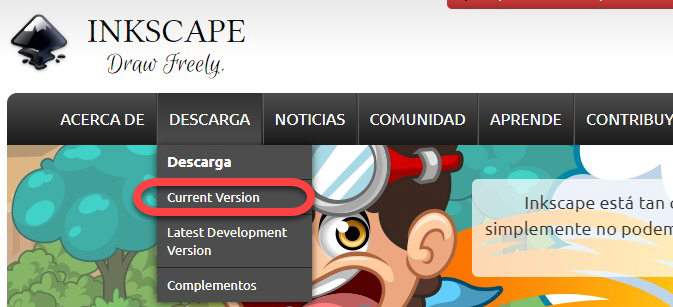     |
| :---------------------------------------------: |
| **Figura 1:** *Acceder a la página de Inkscape* |

| 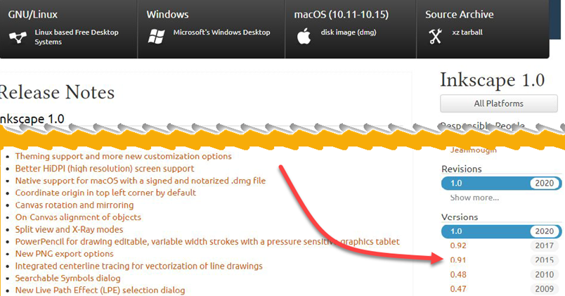 |
| :---------------------------------------------: |
|       **Figura 2:** *Elegir versión 0.91*       |

|     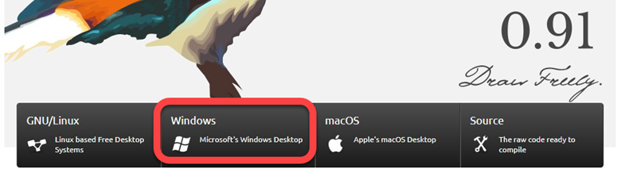     |
| :---------------------------------------------: |
| **Figura 3:** *Sistema operativo Windows* |

|     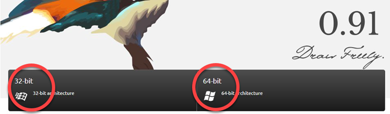     |
| :---------------------------------------------: |
| **Figura 4:** *Elegir la configuración* |

|     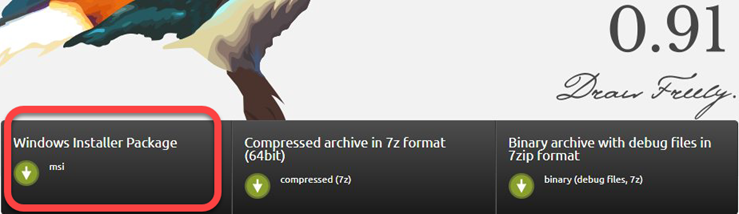     |
| :---------------------------------------------: |
| **Figura 5:** *Descargar instalador* |

hasta obtener el instalador

``` {style="Latex-color"}
inkscape-0.91-x64.msi
```

y desarrollar la instalación "normal".

## Tres archivos <a name="tres-archivos"></a>

Al acceder a la página, se siguen las indicaciones:

|          |
| :---------------------------------------------: |
| **Figura 6:** *Página de svg2tikz* |

Una vez se tiene el archivo svg2tikz-master.zip, se descomprime y dentro de esta carpeta hay otra carpeta dentro de la cual están los archivos que se necesitan:

|     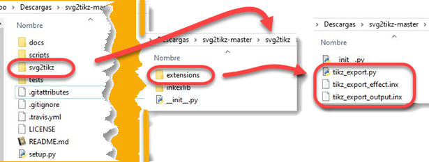     |
| :---------------------------------------------: |
| **Figura 7:** *Contenido de la carpeta svg2tikz-master* |

Entonces, estos archivos

``` {style="Latex-color"}
tikz_export.py, tikz_export_effect.inx y tikz_export_output.inx
```

se copian y se pegan dentro de la carpeta <u>extensions</u>, ubicada en la ruta:

``` {style="Latex-color"}
C:\Program Files (x86)\Inkscape\share\extensions
```

## Carpeta Writetex

El link abre la página que contiene el archivo para descarga: Source.code(zip) y luego se abre la carpeta WriteTeX-1.7.0:

|     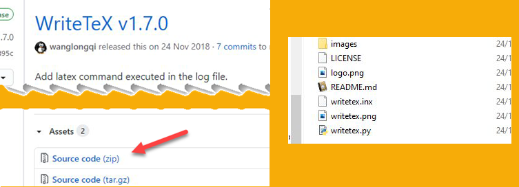     |
| :---------------------------------------------: |
| **Figura 8:** *Descargar WriteTeX versión 1.7.0* |

De esta carpeta se toman los archivos

``` {style="Latex-color"}
writetex.py, writetex.inx
```

y tal como se indicó al final de la sección [2.2](# Tres archivos), llevan a la carpeta <u>extensions</u>, ubicada en la ruta:

``` {style="Latex-color"}
C:\Program Files (x86)\Inkscape\share\extensions
```

## Carpeta pdf2svg

Con el respectivo link de la página se toma:

|     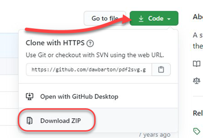     |
| :---------------------------------------------: |
| **Figura 9:** *Descargar Pdfsvg* |

Al descomprimir, en la carpeta pdf2svg-master cambiar el nombre dejando solamente pdf2svg y pegarla en "archivos de programa", quedando:

``` {style="Latex-color"}
C:\Program Files\pdf2svg
```

Ahora se configura el PATH en Variables de entorno, siguiendo la imagen:

|     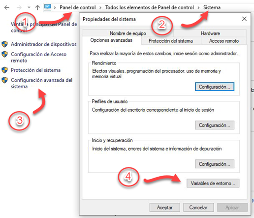     |
| :---------------------------------------------: |
| **Figura 10:** *Path para pdfsvg* |

Una vez se pulse el botón rotulado con 4, en la nueva ventana seleccionar la línea PATH y enseguida pulsar editar

|     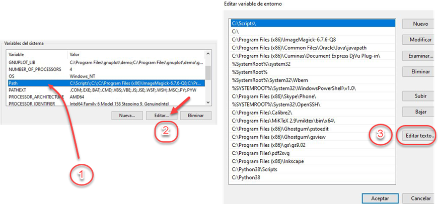     |
| :---------------------------------------------: |
| **Figura 11:** *Seleccionar Editar* |

En la nueva ventana en Valor de la variable, se ubica al final después del punto y coma (si no lo hay lo agrega), como se observa en la figura [12](#fig:13agregarpath) y "pega la ruta"


``` {style="Latex-color"}
C:\Program Files\pdf2svg
```

Hecho esto finaliza pulsando sucesivamente el botón Aceptar, hasta salir de propiedades del sistema y cerrar Panel de Control.

<a name="fig:13agregarpath"></a>

|     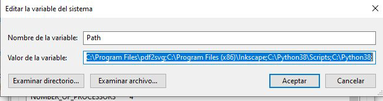     |
| :---------------------------------------------: |
| **Figura 12:** *Agregar PATH* |

## Instalar pstoedit

El último link abre la página que muestra

|          |
| :---------------------------------------------: |
| **Figura 13:** *Descargar Pstoedit* |

y se ejecuta el correspondiente archivo

``` {style="Latex-color"}
pstoeditsetup_x64.exe
```

En la instalación, en la ventana `select component`, cambiar `Basic Installation` por
`Full installation`, como se muestra en la imagen

| 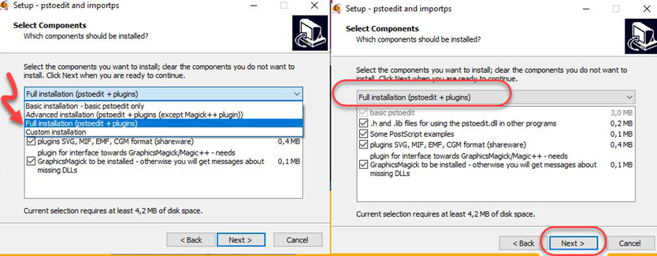  |
| :------------------------------------------: |
| **Figura 14:** *Selección de la opción Full* |

Por último, configurar variables de entorno (PATH) agregando

``` {style="Latex-color"}
C:\Program Files\pstoedit
```

# Opción guardar como: TikZcode(\*.tex)

Se espera que en el programa Inkscape se genere la opción de guardar como archivo .tex:

|     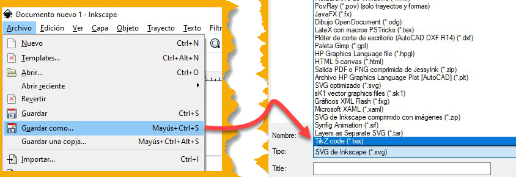     |
| :---------------------------------------------: |
| **Figura 15:** *La anterior* |


> **Nota:**
> Para registrar el PATH correctamente, se recomienda revisar la ruta de instalación del archivo o programa correspondiente.

## Resultados con TikZ

A continuación se presenta un diagrama realizado con Inkscape

| 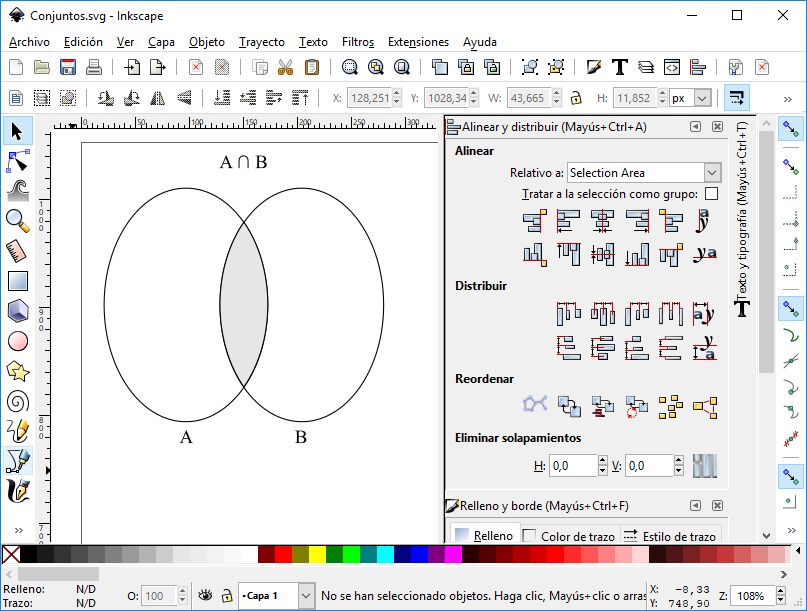 |
| :------------------------------------------------: |
|       **Figura 16:** *Diagrama en Inkscape*        |

Luego de realizar el procedimiento descrito en la figura [14](#fig:16bguardarcomo) el resultado es el siguiente

| 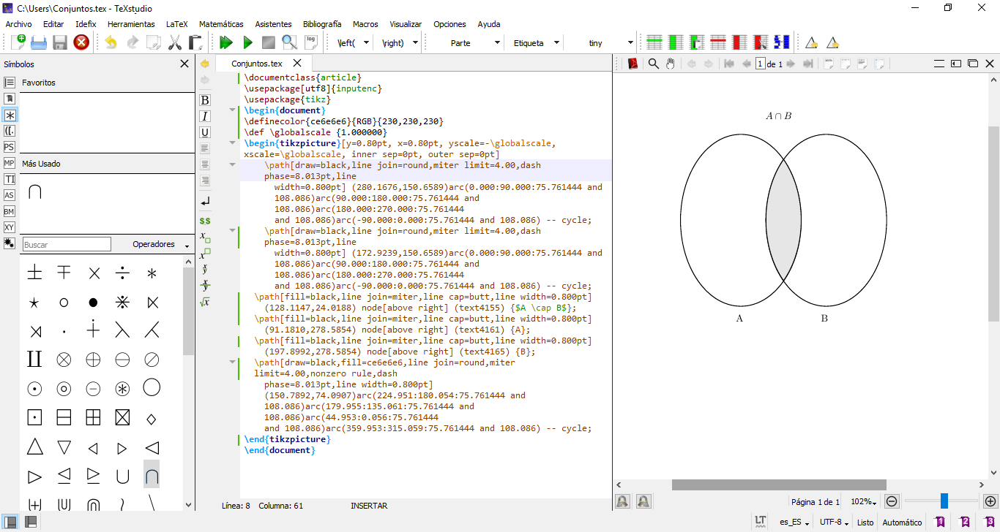 |
| :-------------------------------------------------: |
|         **Figura 17:** *Resultado TikZcode*         |

Con el objetivo de mostrar todo el código y corregir algún error en la compilación con Texstudio se eliminaron los espacios y se colocó el símbolo de intersección en código LaTeX.

## Agregar flechas o decoraciones

Aunque con Inkscape podemos realizar cualquier gráfica, se tiene el inconveniente que al exportar con la extensión TikZcode no reconoce las flechas o puntos. Para solucionarlo debemos instalar la extensión ExportXY, para obtener las coordenadas XY de los nodos de cualquier figura o trayecto en Inkscape, para ello accedemos al siguiente link y seleccionamos

``` {style="Latex-color"}
https://github.com/jwcliff/Inkscape_Exportxy
```
| 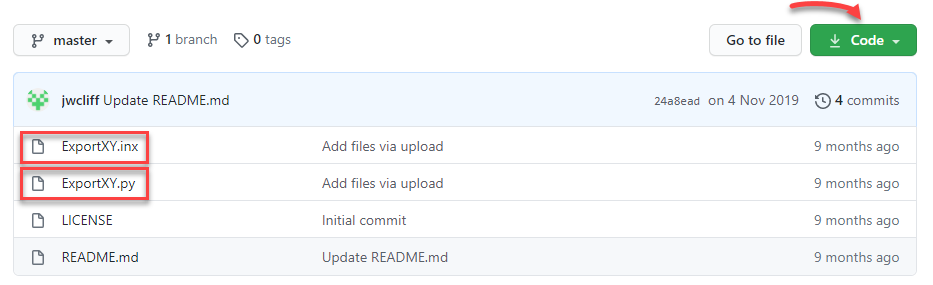 |
| :----------------------------------------------: |
|        **Figura 18:** *Inkscape Exportxy*        |

De esta carpeta se toman los archivos

``` {style="Latex-color"}
ExportXY.inx, ExportXY.py
```

se llevan a la carpeta <u>extensions</u>, ubicada en la ruta:

``` {style="Latex-color"}
C:\Program Files (x86)\Inkscape\share\extensions
```

Abrimos Inkscape y seleccionamos cualquier objeto con nodos que tengamos en el lienzo. Vamos a Extensiones -- Exportar -- Export XY.

``` {style="Latex-color"}
https://github.com/jwcliff/Inkscape_Exportxy
```
| 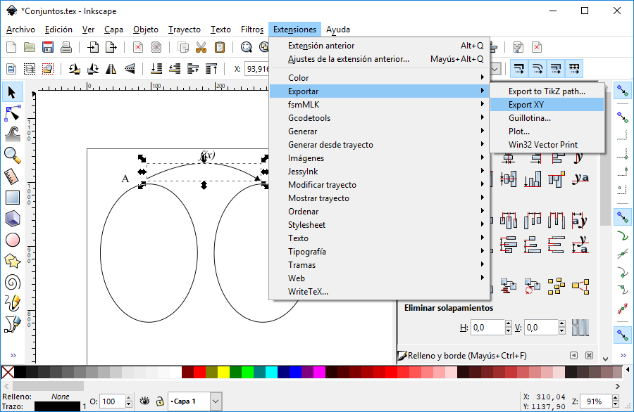 |
| :----------------------------------------------: |
|        **Figura 19:** *Inkscape Exportxy*        |

Nos aparece la ventana con las coordenadas.

| 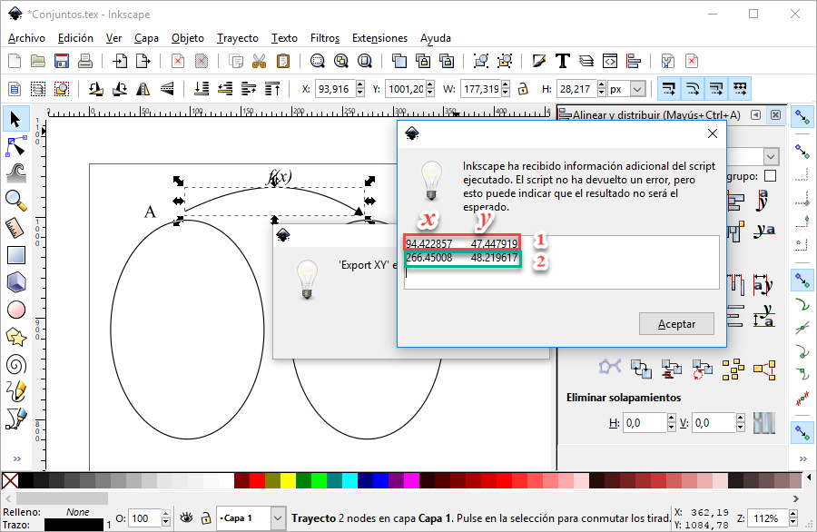 |
| :----------------------------------------------: |
|        **Figura 20:** *Inkscape Exportxy*        |

En nuestro objeto tenemos 2 nodos, y sus coordenadas XY son las que están en los recuadros. Cada fila son las coordenadas de un nodo.

## Ejemplo con ExportXY

Retomando la figura [19 ](#fig:19cExportXY) y realizando los pasos de la sección 3 figura [14](#fig:16bguardarcomo) obtenemos el siguiente resultado en Texstudio

| 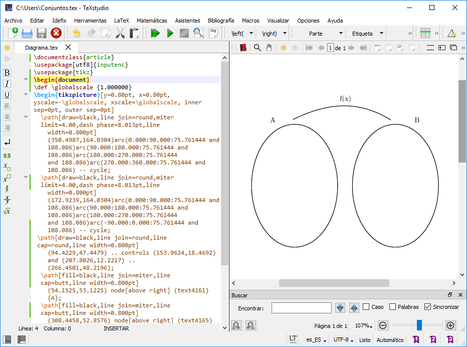 |
| :----------------------------------------------: |
|        **Figura 21:** *Inkscape Exportxy*        |

Para colocar la flecha seguimos los siguientes pasos:

1. Buscamos la coordenada en X usando los tres primeros decimales y verificamos que coincida con la coordenada en Y del nodo.

2. Adicionamos dos lineas en el preámbulo para usar la librería arrows.meta

   ``` {style="Latex-color"}
   \usetikzlibrary{arrows.meta}
           \tikzset{>={Latex[width=1.5mm,length=1.5mm]}}
   ```

3. Por último, en la linea *path* del nodo se incluye la siguiente instrucción

   ``` {style="Latex-color"}
   \path[->]
   ```

El resultado es el siguiente

| 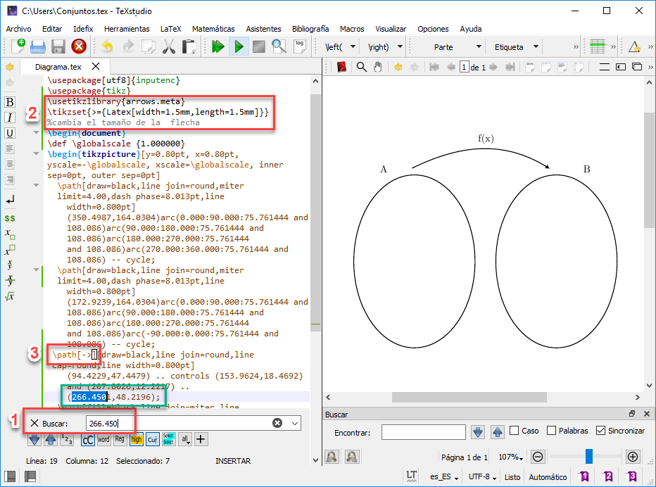 |
| :----------------------------------------------: |
|        **Figura 22:** *Inkscape Exportxy*        |

___

|             |
| :----------------------------------------------------------: |
| *"Copyright &copy; 2020 Grupo de Investigación en Estadística GIE"* |

___

